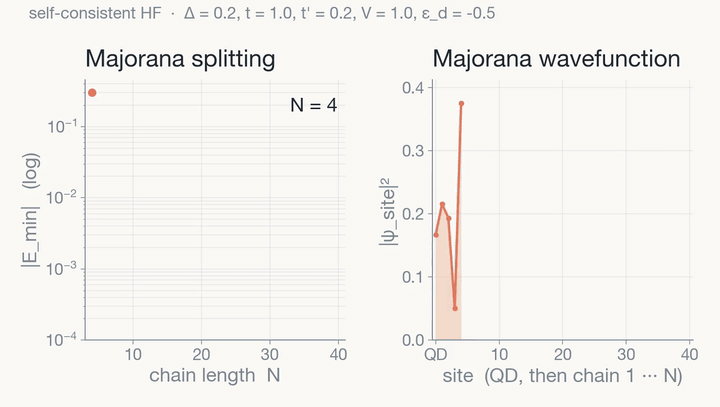

I focused my research on the effects of Coulomb repulsion between a quantum-dot-superconducting-nanowire system on the topological protection of Majorana zero modes quasiparticles. This repo have some of my codes for the thesis and courses

  

`make_animation.py` is a NumPy reimplementation of the Julia code's self-consistent Hartree-Fock solver. It sweeps the chain length N and renders the Majorana mode splitting on a log scale alongside the edge-localized wavefunction. Run with `python3 make_animation.py`, then `ffmpeg -framerate 8 -i anim_frames/frame_%03d.png ... majorana_sweep.mp4`.

### References

- Takagui-Perez, R. Kenyi, and Aligia, A. A., "Effect of interatomic repulsion on Majorana zero modes in a coupled quantum-dot--superconducting-nanowire hybrid system," *Phys. Rev. B*, vol. 109, no. 7, 075416, Feb. 2024. [DOI: 10.1103/PhysRevB.109.075416](https://doi.org/10.1103/PhysRevB.109.075416).